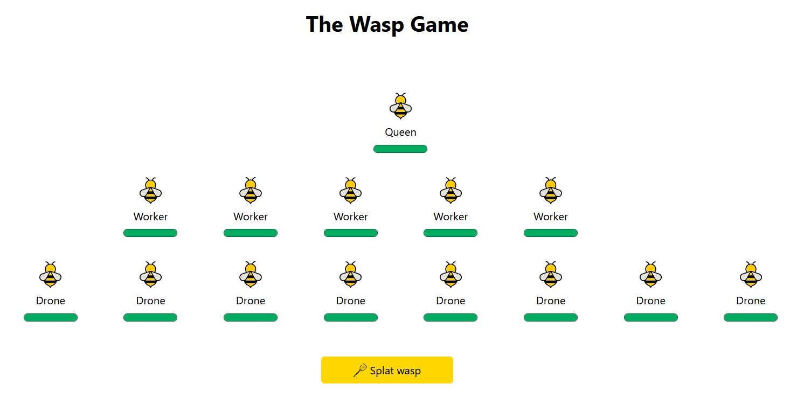

# Wasp Game

You start the game with the following wasps.

1 x Queen:
- 80 Hit Points, loses 7 hit points each time it is hit.

5 x Worker wasps:
- Each one starts with 68 hit points, and loses 10 hit points each time it is hit

8 x Drone wasps:
- Each starts with 60 hit points and loses 12 hit points each time it is hit.

Each click of the "Splat wasp" button hits a random wasp and reduces their current points by their damage value. If they reach zero they're dead and cannot be hit again.

All wasps die if the queen is killed.

### Text version

Loading the `index.html` file will offer the text version of the game.

### Styled version

Adding `?style=true` to the end of the URL will result in a styled version of the game.

## To include on a page

Add a script tag with a src referencing the `wasp-game.js` file.

Call `renderWaspGame('#TargetElement', 'replace');` to render the game, where `#TargetElement` is a reference to an element's ID that you want the game added to.

The second parameter offer a choice of:

* replace -- replace the contents of the target element
* replaceParent -- replace the target element entirely
* append -- add the game to the target element

## Tests

The `game-tests.html` file contains some tests on the underlying mechanics and will show the results of these tests.
